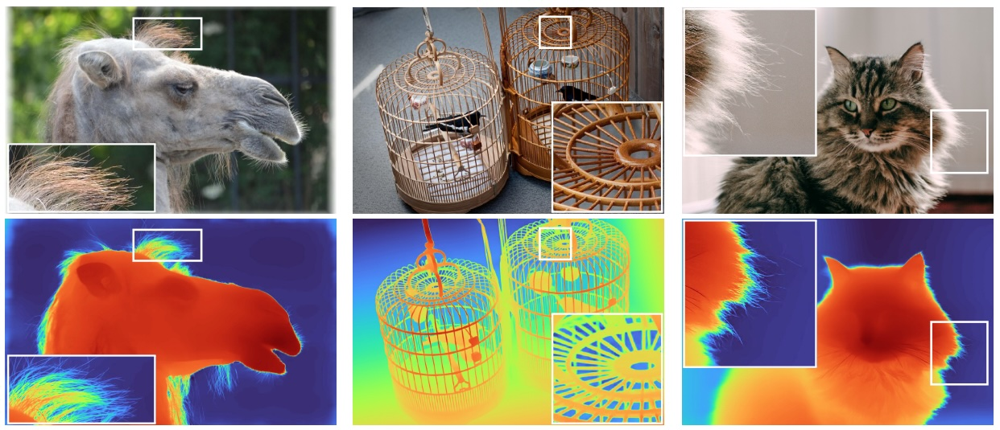

.png)

# DepthPro: Sharp Monocular Depth Estimation

**DepthPro** is a foundational model designed for zero-shot monocular depth estimation. Leveraging a multi-scale vision transformer (ViT-based, Dinov2), the model optimizes for dense predictions by processing images at multiple scales. Each image is split into patches, encoded using a shared patch encoder across scales, then merged, upsampled, and fused via a DPT decoder.

- **Research Paper**: [Depth Pro: Sharp Monocular Metric Depth in Less Than a Second](https://arxiv.org/pdf/2410.02073)
- **Authors**: [Aleksei Bochkovskii](https://arxiv.org/search/cs?searchtype=author&query=Bochkovskii,+A), [Amaël Delaunoy](https://arxiv.org/search/cs?searchtype=author&query=Delaunoy,+A), et al.
- **Official Code**: [apple/ml-depth-pro](https://github.com/apple/ml-depth-pro)
- **Official Weights**: [apple/DepthPro](https://huggingface.co/apple/DepthPro)
- **Unofficial Weights**: [geetu040/DepthPro](https://huggingface.co/geetu040/DepthPro)
- **Web UI Interface**: [spaces/geetu040/DepthPro](https://huggingface.co/spaces/geetu040/DepthPro)
- **Interface in Transformers (Open PR)**: https://github.com/huggingface/transformers/pull/34583

# DepthPro: Beyond Depth Estimation

In this repository, we use this architechture and the available pretrained weights for depth-estimation, to explore its capabilities in further image processings tasks like **Image Segmentation** and **Image Super Resolution**.

**Quick Links**

| Task                           | Web UI Interface                                                                                  | Code-Based Inference and Weights                                                                      | Training Code on Colab                                                                                                                                  | Training Code on Kaggle                                                                                                                        | Training Logs                                                     | Validation Outputs                                                          |
| ------------------------------ | ------------------------------------------------------------------------------------------------- | ----------------------------------------------------------------------------------------------------- | ------------------------------------------------------------------------------------------------------------------------------------------------------- | ---------------------------------------------------------------------------------------------------------------------------------------------- | ----------------------------------------------------------------- | --------------------------------------------------------------------------- |
| **Depth Estimation**           | [DepthPro](https://huggingface.co/spaces/geetu040/DepthPro)                                       | [geetu040 / DepthPro](https://huggingface.co/geetu040/DepthPro)                                       | -                                                                                                                                                       | -                                                                                                                                              | -                                                                 | -                                                                           |
| **Human Segmentation**         | [DepthPro Segmentation Human](https://huggingface.co/spaces/geetu040/DepthPro_Segmentation_Human) | [geetu040 / DepthPro Segmentation Human](https://huggingface.co/geetu040/DepthPro_Segmentation_Human) |  | -                                                                                                                                              | [Training Logs](assets/training_logs/Segmentation_Human.png)      | [Validation Outputs](assets/validation_outputs/Segmentation_Human.jpg)      |
| **Super Resolution (4x 256p)** | [DepthPro SR 4x 256p](https://huggingface.co/spaces/geetu040/DepthPro_SR_4x_256p)                 | [geetu040 / DepthPro SR 4x 256p](https://huggingface.co/geetu040/DepthPro_SR_4x_256p)                 |  |  | [Training Logs](assets/training_logs/SuperResolution_4x_256p.png) | [Validation Outputs](assets/validation_outputs/SuperResolution_4x_256p.png) |
| **Super Resolution (4x 384p)** | [DepthPro SR 4x 384p](https://huggingface.co/spaces/geetu040/DepthPro_SR_4x_384p)                 | [geetu040 / DepthPro SR 4x 384p](https://huggingface.co/geetu040/DepthPro_SR_4x_384p)                 |  |  | [Training Logs](assets/training_logs/SuperResolution_4x_384p.png) | [Validation Outputs](assets/validation_outputs/SuperResolution_4x_384p.png) |

## DepthPro: Image Segmentation (Human)

- For Web UI Interface: [**spaces/geetu040/DepthPro_Segmentation_Human**](https://huggingface.co/spaces/geetu040/DepthPro_Segmentation_Human)
- For Code-Based Inference and model weights: [**geetu040/DepthPro_Segmentation_Human**](https://huggingface.co/geetu040/DepthPro_Segmentation_Human)
- For Training, check the notebook on:
  - 
  - [Segmentation_Human.ipynb](Segmentation_Human.ipynb)

<table>
  <thead>
    <tr>
      <th>Input Image</th>
      <th>Ground Truth</th>
      <th>Prediction</th>
    </tr>
  </thead>
  <tbody>
    <tr>
      <td colspan="3">
        
      </td>
    </tr>
  </tbody>
</table>

We modify [Apple's DepthPro for Monocular Depth Estimation](https://arxiv.org/abs/2410.02073) model for `Image Segmentation Task`.
1. The pre-trained depth estimation model is used with slight changes in the head layer to make it compatible with the segmentation task.
2. Hidden features maps have been generated to get the insights of the encoder and fusion stages of the model.
3. For `training` and `validation`, we use `Human Segmentation Dataset - Supervise.ly`, from kaggle: [tapakah68/supervisely-filtered-segmentation-person-dataset](https://www.kaggle.com/datasets/tapakah68/supervisely-filtered-segmentation-person-dataset)
   - It contains 2667 samples which are randomly split into 80% training and 20% validation.
   - each sample contains an image and its corresponding mask.
4. **The model produces exceptional results on validation set with an `IoU score of 0.964` and `Dice score of 0.982`, beating the [previous state of art IoU score of 0.95](https://www.kaggle.com/code/saeedghamshadzai/person-segmentation-deeplabv3-pytorch) on this dataset.**

  
See the training logs

  

  
See all Validation Outputs

  

## DepthPro: Image Super Resolution (4x 256px)

- For Web UI Interface: [**spaces/geetu040/DepthPro_SR_4x_256p**](https://huggingface.co/spaces/geetu040/DepthPro_SR_4x_256p)
- For Code-Based Inference and model weights: [**geetu040/DepthPro_SR_4x_256p**](https://huggingface.co/geetu040/DepthPro_SR_4x_256p)
- For Training, check the notebook on:
  - 
  - 
  - [SuperResolution_4x_256p.ipynb](SuperResolution_4x_256p.ipynb)

<table>
  <thead>
    <tr>
      <th>Low Resolution 256px (Input Image)</th>
      <th>Super Resolution 1024px (Depth Pro)</th>
      <th>High Resolution 1024px (Ground Truth)</th>
    </tr>
  </thead>
  <tbody>
    <tr>
      <td colspan="3">
        
      </td>
    </tr>
  </tbody>
</table>

We then modify [Apple's DepthPro for Monocular Depth Estimation](https://arxiv.org/abs/2410.02073) model for `Image Super Resolution Task`.
1. The base model architechture is modified for the task of Image Super Resolution from 256px to 1024px (4x upsampling).
2. For `training` and `validation`, we use `Div2k` dataset, introduced in [NTIRE 2017 Challenge on Single Image Super-Resolution: Dataset and Study](https://ieeexplore.ieee.org/document/8014884)
   - It contains high resolution images in 2k resolution, which have been downsampled to `LR_SIZE=256` and `HR_SIZE=1024` for training and validation.
   - It contains
      - 800 training samples
      - 200 validation samples
   - Dataset has been downloaded from kaggle: [soumikrakshit/div2k-high-resolution-images](https://www.kaggle.com/datasets/soumikrakshit/div2k-high-resolution-images)
3. For `testing`, we use `Urban100` dataset, introduced in [Single Image Super-Resolution From Transformed Self-Exemplars](https://www.cv-foundation.org/openaccess/content_cvpr_2015/html/Huang_Single_Image_Super-Resolution_2015_CVPR_paper.html)
   - It contains images in 2 resolutions, 256 (low) and 1024 (high).
   - It contains 100 samples.
   - Dataset has been downloaded from kaggle: [harshraone/urban100](https://www.kaggle.com/datasets/harshraone/urban100)
4. Results:
   - Model achieves best `PSRN score of 24.80` and `SSIM score of 0.74` on validation set.
   - `PSRN score of 21.36` and `SSIM score of 0.62` on test set.
   - Model has been able to restore some of the information from low resolution images.
   - Results are better than most of the generative techniques applied on kaggle, but still has a long way to go to achieve the state of art results.
   - This is because of the nature of Vision Transformers, which are not specifically designed for Super Resolution tasks.

  
See the training logs

  

  
See all Validation Outputs

  

## DepthPro: Image Super Resolution (4x 384px)

- For Web UI Interface: [**spaces/geetu040/DepthPro_SR_4x_384p**](https://huggingface.co/spaces/geetu040/DepthPro_SR_4x_384p)
- For Code-Based Inference and model weights: [**geetu040/DepthPro_SR_4x_384p**](https://huggingface.co/geetu040/DepthPro_SR_4x_384p)
- For Training, check the notebook on:
  - 
  - 
  - [SuperResolution_4x_384p.ipynb](SuperResolution_4x_384p.ipynb)

<table>
  <thead>
    <tr>
      <th>Low Resolution 384px (Input Image)</th>
      <th>Super Resolution 1536px (Depth Pro)</th>
      <th>High Resolution 1536px (Ground Truth)</th>
    </tr>
  </thead>
  <tbody>
    <tr>
      <td colspan="3">
        
      </td>
    </tr>
  </tbody>
</table>

We use the modified [Apple's DepthPro for Monocular Depth Estimation](https://arxiv.org/abs/2410.02073) model for `Image Super Resolution Task`.
1. The base model architechture is modified for the task of Image Super Resolution from 384px to 1536px (4x upsampling).
2. For `training` and `validation`, we use `Div2k` dataset, introduced in [NTIRE 2017 Challenge on Single Image Super-Resolution: Dataset and Study](https://ieeexplore.ieee.org/document/8014884)
   - It contains high resolution images in 2k resolution, which have been downsampled to `LR_SIZE=384` and `HR_SIZE=1536` for training and validation.
   - It contains
      - 800 training samples
      - 200 validation samples
   - Dataset has been downloaded from kaggle: [soumikrakshit/div2k-high-resolution-images](https://www.kaggle.com/datasets/soumikrakshit/div2k-high-resolution-images)
3. Results:
   - Model achieves best `PSRN score of 27.19` and `SSIM score of 0.81` on validation set.
   - Model has been able to restore some of the information from low resolution images.
   - Results are better than the generative techniques applied on kaggle, but are slightly off to achieve the state of art results.
   - This is because of the nature of Vision Transformers, which are not specifically designed for Super Resolution tasks.

  
See the training logs

  

  
See all Validation Outputs

  

